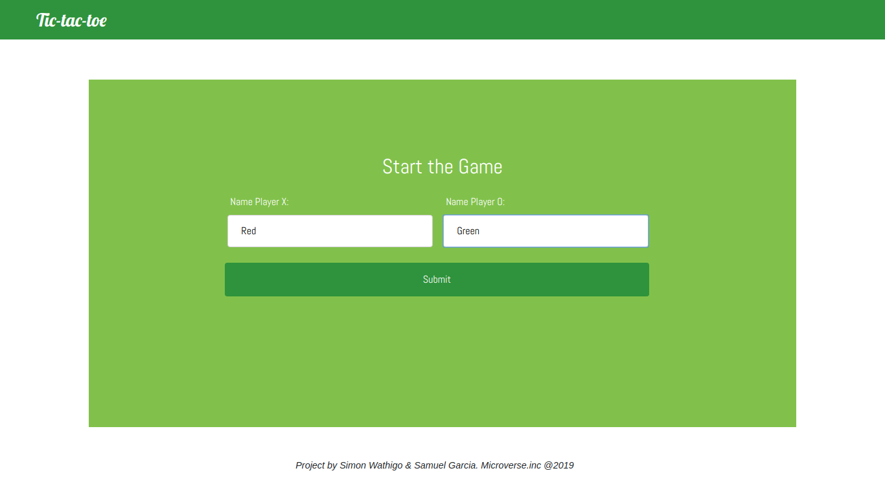
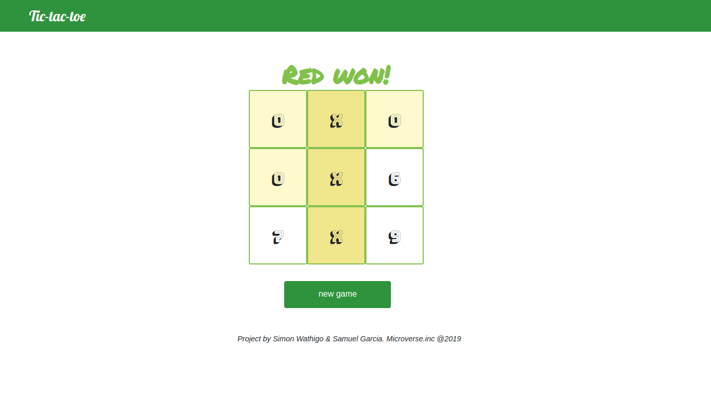

 

  

  <h3 align="center">Tic Tac Toe</h3>

  

    JavaScript Project
     
     
    <a href="https://raw.githack.com/wathigo/Tic-tac-toe-js/master/index.html">View Demo</a>
    ·
    <a href="https://github.com/wathigo/Tic-tac-toe-js/issues">Report Bug</a>
    ·
    <a href="https://github.com/wathigo/Tic-tac-toe-js/issues">Request Feature</a>
  

<!-- TABLE OF CONTENTS -->
## Table of Contents

* [About the Project](#about-the-project)
  * [Built With](#built-with)
* [Contact](#Contact)

<!-- ABOUT THE PROJECT -->
## About The Project

  
  
  

Based on the [ Tic tac toe Project](https://www.theodinproject.com/courses/javascript/lessons/tic-tac-toe-javascript) in the odin project as a part of the Microverse curriculum. The purpose was to have a second contact with Javascript making use of Factory Functions and the Module Pattern.

The project is able to request two names for the players and display a gameboard in which we will be able to play Tic tac toe.

  1) Two players will take turns to mark the spaces on a 3x3 grid. (Clicking with the cursor)
  
  2) The player who succeeds in placing 3 of their marks in a horizontal, vertical, or diagonal row wins the game. 
  
  3) When there are no more spaces left to mark, it is consider a draw. 
  
  4) To place a mark on the grid, type the number on the space you would like to mark! 
     Good luck!

### Built With
* [JavaScript](https://www.javascript.com/)

### Contact

* [Simon Wathigo](https://github.com/wathigo) - wathigosimon@gmail.com - [Linkedin](https://www.linkedin.com/in/simon-wathigo-445370183/)
* [Samuel García Companys](https://github.com/samgaco) - samuelgarciacompanys@gmail.com - [Linkedin](https://www.linkedin.com/in/samuel-garc%C3%ADa-companys-0a848284/)
